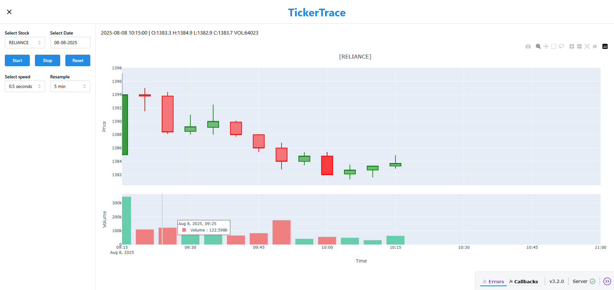

# TickerTrace
TradeReplay is an interactive Dash application for replaying intraday market data from a ClickHouse database. It allows users to visualize historical price action minute by minute, resample data (1min to 1hr), jump forward/back in time, and analyze live updating intraday metrics such as price change, volume extremes, and volatility.

